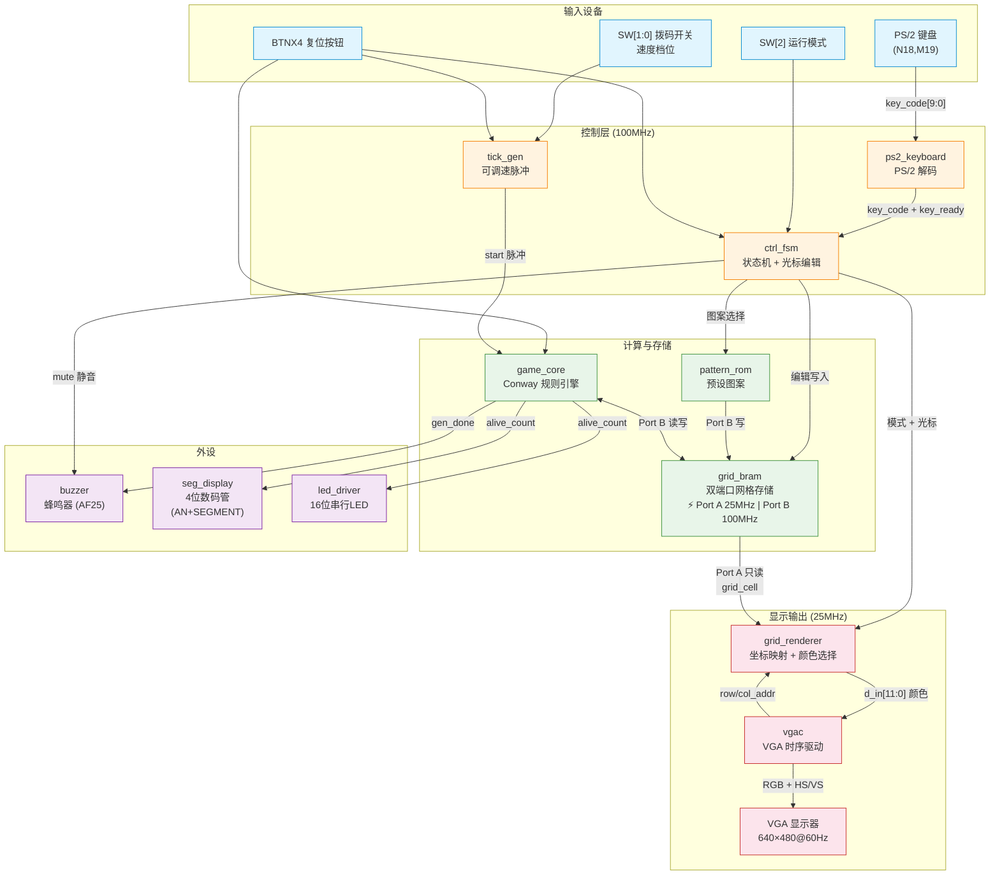

```mermaid
flowchart TB
    subgraph Inputs["输入设备"]
        SW["SW[1:0] 拨码开关<br/>速度档位"]
        SW2["SW[2] 运行模式"]
        KB["PS/2 键盘<br/>(N18,M19)"]
        BTN["BTNX4 复位按钮"]
    end

    subgraph Control["控制层 (100MHz)"]
        PS2["ps2_keyboard<br/>PS/2 解码"]
        FSM["ctrl_fsm<br/>状态机 + 光标编辑"]
        TICK["tick_gen<br/>可调速脉冲"]
    end

    subgraph Core["计算与存储"]
        GC["game_core<br/>Conway 规则引擎"]
        ROM["pattern_rom<br/>预设图案"]
        BRAM["grid_bram<br/>双端口网格存储<br/>⚡ Port A 25MHz | Port B 100MHz"]
    end

    subgraph Display["显示输出 (25MHz)"]
        RND["grid_renderer<br/>坐标映射 + 颜色选择"]
        VGA_DRV["vgac<br/>VGA 时序驱动"]
        VGA["VGA 显示器<br/>640×480@60Hz"]
    end

    subgraph Periph["外设"]
        BEEP["buzzer<br/>蜂鸣器 (AF25)"]
        SEG["seg_display<br/>4位数码管<br/>(AN+SEGMENT)"]
        LED["led_driver<br/>16位串行LED"]
    end

    %% 数据流
    KB -->|"key_code[9:0]"| PS2
    PS2 -->|"key_code + key_ready"| FSM
    SW --> TICK
    SW2 --> FSM
    BTN --> FSM
    BTN --> GC
    BTN --> TICK

    FSM -->|"模式 + 光标"| RND
    FSM -->|"编辑写入"| BRAM
    FSM -->|"图案选择"| ROM

    ROM -->|"Port B 写"| BRAM
    TICK -->|"start 脉冲"| GC
    GC <-->|"Port B 读写"| BRAM
    GC -->|"gen_done"| BEEP
    GC -->|"alive_count"| SEG
    GC -->|"alive_count"| LED
    FSM -->|"mute 静音"| BEEP

    BRAM -->|"Port A 只读<br/>grid_cell"| RND
    RND -->|"d_in[11:0] 颜色"| VGA_DRV
    VGA_DRV -->|"RGB + HS/VS"| VGA
    VGA_DRV -->|"row/col_addr"| RND

    %% 样式
    classDef input fill:#e1f5fe,stroke:#0288d1
    classDef control fill:#fff3e0,stroke:#f57c00
    classDef core fill:#e8f5e9,stroke:#388e3c
    classDef display fill:#fce4ec,stroke:#c62828
    classDef periph fill:#f3e5f5,stroke:#7b1fa2

    class SW,SW2,KB,BTN input
    class PS2,FSM,TICK control
    class GC,ROM,BRAM core
    class RND,VGA_DRV,VGA display
    class BEEP,SEG,LED periph
```
